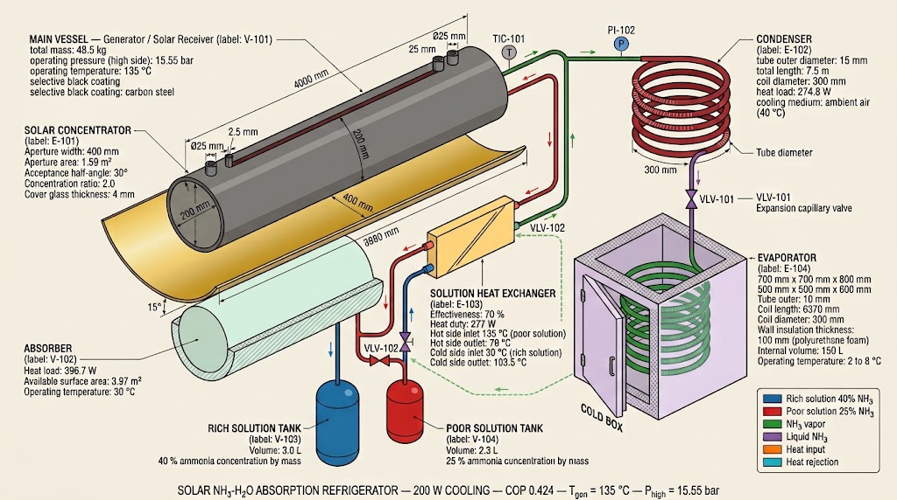

# Solar Absorption Fridge



Solar-powered NH3-H2O absorption refrigeration system for off-grid use.
Designed for household deployment in Sudan and similar climates.

[](https://opensource.org/licenses/MIT)
[](https://www.python.org/downloads/)
[](http://www.coolprop.org/)
[](https://github.com/claythe3ed/solar-absorption-fridge/releases/tag/v0.1.0)
[]()

---

## Why this exists

CoolProp's HEOS backend requires departure-function parameters (β_ij, γ_ij) for every binary pair. For ammonia-water (CAS 7664-41-7 + 7732-18-5), those parameters are not available in the current library.

This is a **deliberate design choice**, not an oversight. As clarified by the CoolProp maintainer in [CoolProp#341](https://github.com/CoolProp/CoolProp/issues/341#issuecomment-5830089558):

> "I think this is a little bit out of scope to use non-reference-grade models in CoolProp for a system that wants a reference-grade implementation."

CoolProp's scope is limited to reference-grade formulations (Helmholtz free energy, IAPWS-2001). The Gibbs-excess class of models — including Ziegler-Trepp — is explicitly out of scope.

**This project provides a validated engineering alternative** for users who need ammonia-water mixture properties without a REFPROP license.

Three paths are documented and numerically quantified:

| Path | Status | Accuracy | License |
|---|---|---|---|
| CoolProp pure components | Works today | NIST-traceable | MIT |
| teqp (`AmmoniaWaterTillnerRoth`) | Works on x86_64 | IAPWS-2001 reference | MIT |
| Ziegler-Trepp (this repo) | Validated | ±0.63 °C vs CoolProp | MIT |

**Validation summary** (see `src/thermo/comparison/teqp_vs_zt.py`):

- 12 pure-component points, P = 1 to 25 bar
- Max error: **0.63 °C** (water at 25 bar)
- Mean error: **0.32 °C**
- Cycle COP: **0.424** (energy balance closed to 0.00 W)

Full technical discussion in [CoolProp#341](https://github.com/CoolProp/CoolProp/issues/341).

---

## Quick Start

```bash
git clone https://github.com/claythe3ed/solar-absorption-fridge.git
cd solar-absorption-fridge
python3 -m venv venv
source venv/bin/activate
pip install -r requirements.txt

# Run thermodynamic validation
python src/thermo/ziegler_trepp_props.py

# Run full cycle model
python src/thermo/cycle_model.py

# Compare teqp vs Ziegler-Trepp
python src/thermo/comparison/teqp_vs_zt.py

# Size solar collector
python src/geometry/solar_collector.py

# Size all mechanical components
python src/geometry/components_sizing.py

# Generate Bill of Materials
python src/geometry/bom_quantities.py

Validation Results

The Ziegler-Trepp implementation was validated against CoolProp (pure components) and published literature.
Test	Computed	Reference	Error
Pure NH3 at 15.5 bar	39.70 °C	40.0 °C (CoolProp)	0.30 °C
Pure NH3 at 10 bar	24.65 °C	24.9 °C (CoolProp)	0.25 °C
Pure H2O at 1 bar	98.98 °C	99.6 °C (NIST)	0.62 °C
y_NH3 at 15.5 bar, x=0.25	0.9059	0.90-0.92 (Herold)	in band
Cycle COP (T_gen=135°C)	0.424	0.4-0.6 (published)	within band
Energy balance closure	0.00 W	0.00 W (ideal)	exact

Full numerical comparison against teqp (IAPWS-2001): 12 points, P = 1 to 25 bar, max error 0.63 °C, mean error 0.32 °C. See results/logs/teqp_vs_zt_*.txt.
Design Summary
Component	Specification
Cooling capacity	200 W
Cold box	150 L, target 2-8 °C
COP	0.424
Working pair	NH3 (refrigerant) + H2O (absorbent)
Generator / receiver	200 mm x 4 m carbon steel, 2.5 mm wall, 48.5 kg
Solar collector	CPC, 400 mm aperture, 3.98 m length, 1.59 m2
Condenser	7.5 m x 15 mm finned steel, air-cooled
Evaporator	6.37 m x 10 mm finned steel, in cold box
Solution tanks	3.0 L rich + 2.3 L poor
Operating pressures	2.36 bar (low) / 15.55 bar (high)

Full design in docs/DESIGN_SUMMARY.md.
Project Structure
text

solar-absorption-fridge/
|-- src/
|   |-- thermo/              # Thermodynamic models
|   |   |-- ziegler_trepp_props.py
|   |   |-- cycle_model.py
|   |   |-- ammonia_properties.py
|   |   |-- comparison/      # teqp vs ZT validation
|   |-- geometry/            # Solar, components, BOM, P&ID
|   |-- main.py
|-- cad/
|   |-- scripts/             # FreeCAD generator scripts
|   |-- step/                # STEP files
|   |-- stl/                 # STL files
|-- docs/
|   |-- DESIGN_SUMMARY.md
|   |-- SESSION_SUMMARY.md
|   |-- images/              # Engineering diagrams
|   |-- datasheets/          # Coefficient tables
|   |-- patents/             # Reference patents
|   |-- report/              # PDF report + source
|-- results/
|   |-- plots/               # P&ID, assembly renders
|   |-- logs/                # Simulation logs
|   |-- bom.csv              # Bill of Materials
|-- notes/
    |-- log.md               # Development journal

Thermodynamic Model

    Pure components (NH3, H2O): CoolProp 8.0 (NIST-accurate)

    Mixture (NH3-H2O): Ziegler-Trepp (1984) Gibbs-excess model

        Coefficients E1-E16 cross-validated between two independent sources

        Bubble/dew points: Patek & Klomfar (1995)

    Reference validation: teqp 0.23.2 (AmmoniaWaterTillnerRoth)

        12 pure-component points, max error 0.63 °C

        Full mixture VLE comparison in progress

CAD Models

All models generated by Python scripts in FreeCAD 1.0 (headless).
Component	Dimensions	Script
Generator	200 mm OD x 4 m, 2.5 mm wall	cad/scripts/generator.py
CPC Mirror	400 mm x 3980 mm parabolic	cad/scripts/all_components.py
Condenser	15 mm x 7.5 m, 5 rings	cad/scripts/all_components.py
Evaporator	10 mm x 6.37 m, 7 rings	cad/scripts/all_components.py
Cold Box	700 x 700 x 800 mm hollow	cad/scripts/all_components.py

Assembly renders in results/plots/assembly_*.png.
Bill of Materials

35 items across 8 categories. Quantities only (no prices — the SDG/USD rate is not stable).

Full list in results/bom.csv. Generator script: src/geometry/bom_quantities.py.
Documentation

    Design Report (PDF) — 6-page Swiss-design report

    Wiki — Detailed design notes

    CoolProp Issue #341 — Workaround discussion

    teqp Issue #193 — ARM64 build report

    Design Summary — Components and cycle data

    Session Summary — Development log

References

    Ziegler & Trepp (1984), Int. J. Refrigeration 7(2):101-106

    Patek & Klomfar (1995), Int. J. Refrigeration 18(4):228-234

    Tillner-Roth & Friend (1998), J. Phys. Chem. Ref. Data 27(1):63-96

    Kherris et al. (2013), Thermal Science 17(3):891-902

    Herold, Radermacher, Klein — Absorption Chillers and Heat Pumps, CRC Press

Related Work

    teqp — Same author as CoolProp. Provides AmmoniaWaterTillnerRoth() as a direct implementation of Tillner-Roth & Friend (1998). Recommended by the CoolProp maintainer.

    CoolProp Issue #341 — The long-standing gap this project documents and works around.

License

MIT — see LICENSE.
Author

Muhammad Ali (@claythe3ed)
